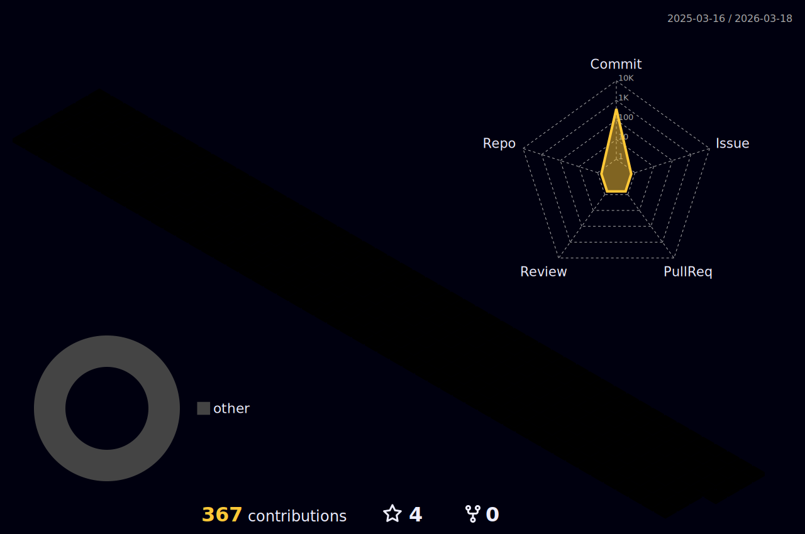

<h1 align="center">
 Hello World, I'm Jerry! 👋 
</h1>

 

### 👨🏻‍💻 &nbsp;About Me
- 🎓 &nbsp;I'm currently studying Philosophy, Computer science and statistics at the University of Toronto
- 🤖 &nbsp;I’m currently working on **iOS and Web development**
- 🌱 &nbsp;I’m currently looking into **MacOS devlopment**
- 🏃🏻‍♂️ &nbsp;Fun fact: Marathon and running are one of my biggest passions!
- 📫 &nbsp;Reach out to me at [jerrylai19990120@gmail.com](jerrylai19990120@gmail.com) for questions and more fun stuff!
- 📄 &nbsp;Check out my [Resume](https://docs.google.com/document/d/e/2PACX-1vS5XwHEBpiEomYS0HVYUccPKvTmpWxVJKgidQpVHTZcwk3QMkJGE0PsQqiFRhhpGHu_J-8EfTuhYcd2/pub)
<!-- - 🎹 &nbsp;Learn more about me at thejerrylaiportfolio.com -->

### 🛠 &nbsp;Language and Tools
&nbsp;&nbsp;&nbsp;&nbsp;&nbsp;&nbsp;&nbsp;&nbsp;&nbsp;&nbsp;&nbsp;&nbsp;&nbsp;&nbsp;&nbsp;&nbsp;&nbsp;&nbsp;&nbsp;&nbsp;&nbsp;

### 📈 My GitHub Stats:

<a href="https://github.com/jerrylai19990120">
  
  &nbsp;&nbsp;&nbsp;&nbsp;
  
</a>

  
  

 
